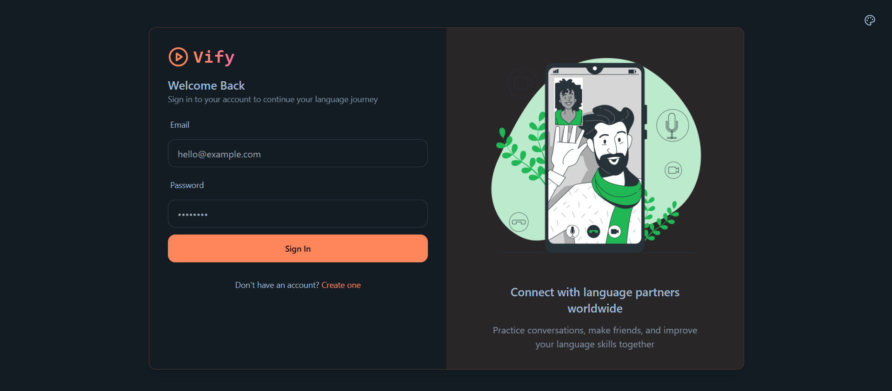
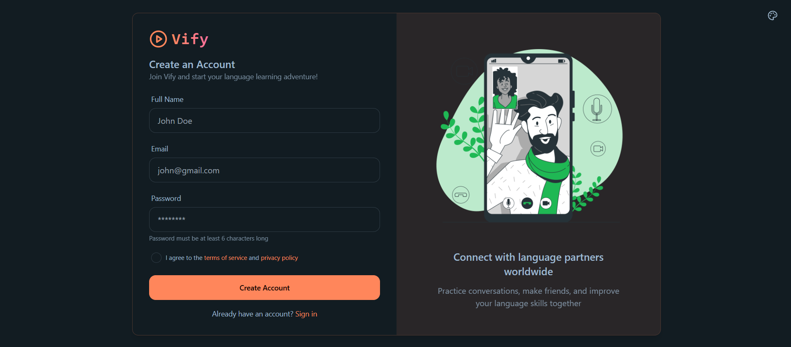
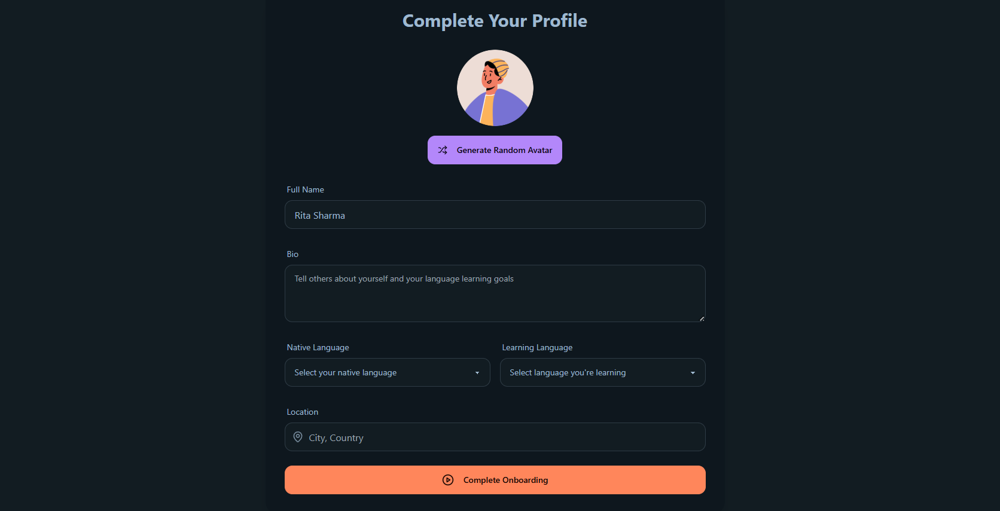
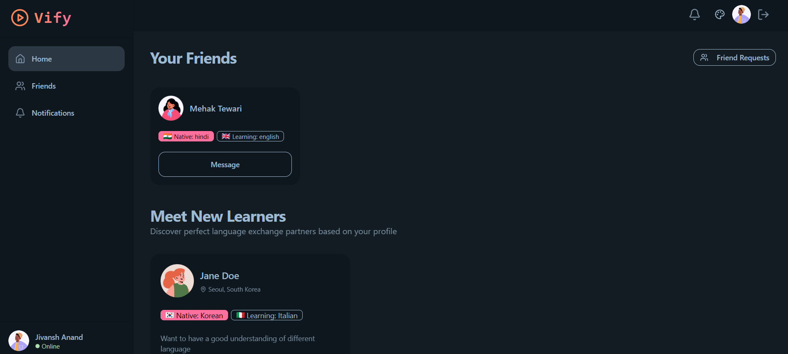
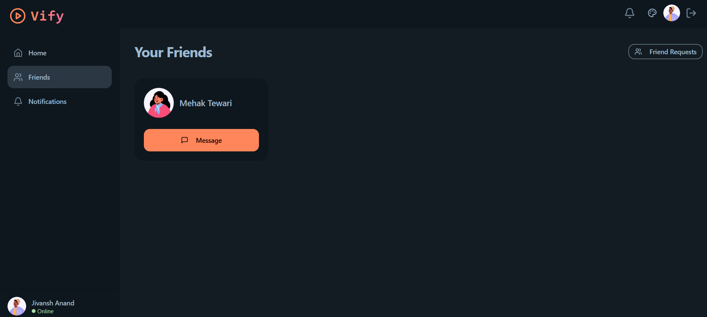
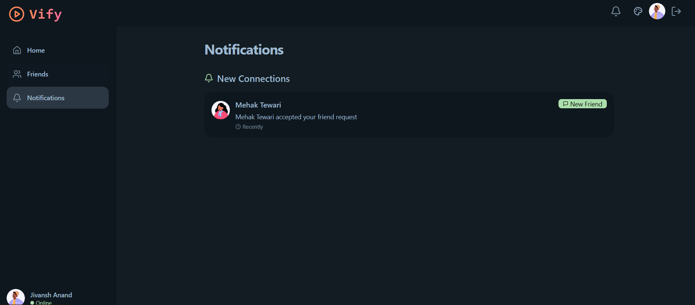
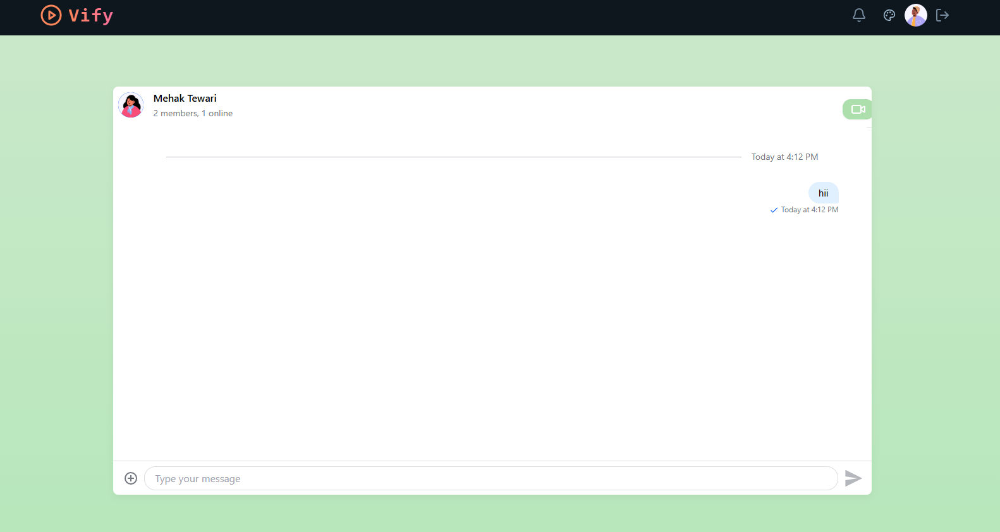
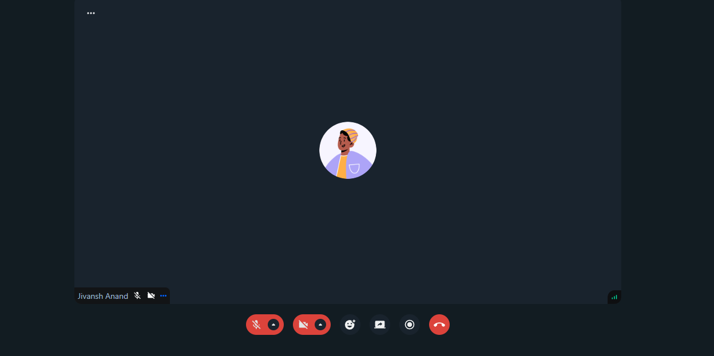

# 🌍 Vify — Language Exchange Platform


Vify is a full-stack language exchange platform that connects users worldwide to help them practice and improve foreign language skills in real time. It features friend requests, private chats, user matching, and customizable themes — all wrapped in a modern, responsive interface.

---

## 🚀 Live Demo

👉 **Try it now:** [https://vify.onrender.com]

---

## ✨ Features

- 🔐 **User Authentication** – Sign up, login, and secure sessions.
- 🧑‍🤝‍🧑 **Friend System** – Send, accept, and manage friend requests.
- 💬 **Real-Time Chat** – Chat privately with friends using Socket.io.
- 🌐 **Language Matching** – Get paired with users based on your native & learning languages.
- 🎨 **Theme Selector** – Choose from multiple themes (light, dark, etc.).
- 📱 **Responsive UI** – Works beautifully on all devices.
- 📷 **Profile Avatars** – Add personality to your account.

---

## 📸 Screenshots











---

## 🛠️ Tech Stack

--

| Frontend | Backend           | Database | Other                        |
| -------- | ----------------- | -------- | ---------------------------- |
| React.js | Node.js + Express | MongoDB  | Socket.io, Tailwind, DaisyUI |

---

## 📂 Folder Structure (MERN Stack)

```md 

vify/
├── frontend/                     # React frontend
│   ├── public/
│   │   └── i.png               # Static assets
│   └── src/
│       ├── components/         # Reusable UI components (e.g. Navbar, ThemeSelector)
│       ├── hooks/              # Custom hooks (useLogin, useSignUp, useAuthUser, etc.)
│       ├── pages/              # Route-level pages (HomePage, LoginPage, SignUpPage)
│       ├── store/              # Zustand store (theme, auth)
│       ├── lib/                # Helper functions, utils, API calls
│       ├── App.jsx
│       └── main.jsx            # React entrypoint
├── backend/                     # Node/Express backend
│   ├── controllers/           # Request handlers
│   ├── models/                # Mongoose schemas (User, Message, etc.)
│   ├── routes/                # Express routers for auth, chat, friends
│   ├── utils/                 # JWT, socket initialization, etc.
│   ├── server.js              # Server setup, socket.io integration
│   └── .env                   # Env variables (MONGODB_URI, JWT_SECRET)
├── README.md
├── vite.config.js
├── package.json(s)            # Possibly separate for client/server
└── tsconfig.json (or jsconfig) 

--


## ⚙️ Getting Started Locally

--

### Prerequisites
- Node.js
- MongoDB
- Git

### Clone and Run

```md 

- git clone [https://github.com/mehaktewari/vify]
- cd vify

### Install client dependencies
- cd frontend
- npm install

### Install server dependencies
- cd ../backend
- npm install

### Create `.env` file in /server with:
### MONGODB_URI=your-mongodb-uri
### JWT_SECRET=your-secret-key

### Run backend
- npm run dev

### In another terminal, run frontend
- cd ../frontend
- npm run dev

---

## 🌍 Deployment

--

- Frontend: Vercel / Render (React build)
- Backend: Render (Node.js)
- Database: MongoDB Atlas
- Live Site 👉 [https://vify.onrender.com]


---


## 📄 License

--
- This project is licensed under the MIT License — see the LICENSE file for details.

---

## 💬 Contact

--

- Have questions? Want to contribute? Let’s connect!

Email: mehaktewari07@gmail.com
LinkedIn: [https://linkedin.com/in/mehak-tewari-04934b247]
